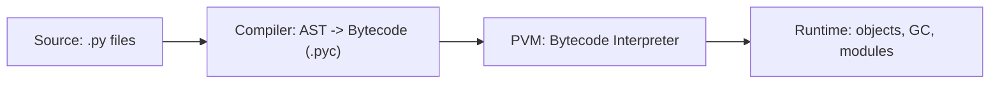
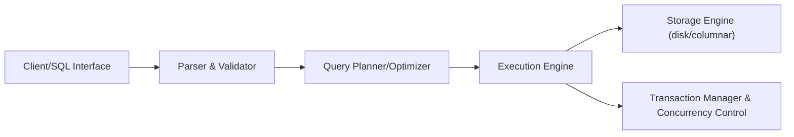

# Day 1 Notes: Python Setup and SQL Basics

## Python Installation and Setup

- Install Python and verify with `python --version`.
- Create a virtual environment:
  ```powershell
  python -m venv .venv
  .\.venv\Scripts\Activate.ps1
  ```
- Install packages with `pip install pandas` or other libraries.

## Python Execution Flow

- Python source code (`.py`) is parsed and compiled to bytecode.
- Bytecode is stored in `__pycache__` as `.pyc` files.
- The Python Virtual Machine (PVM) executes the bytecode.

## Memory Management

- Python uses reference counting to track object lifetimes.
- The garbage collector handles cyclic references.
- The Global Interpreter Lock (GIL) ensures only one native thread executes Python bytecode at a time.
- The GIL is more important for CPU-bound tasks than for I/O-bound tasks.

## Core Python Concepts for Day 1

- Variables and data types
- Control flow: `if`, `for`, `while`
- Functions and return values
- File I/O with CSV and JSON
- Standard libraries: `os`, `pathlib`, `json`, `csv`

## SQL Basics

- Learn the SQL query structure: `SELECT`, `FROM`, `WHERE`, `ORDER BY`
- Understand query execution steps: parsing, validation, optimization, execution
- Practice using basic SQL queries on sample tables
- Know that SQL runs through parser, optimizer, query engine, and storage layers

## Employee Data Analyzer Design

- Load employee data from CSV
- Calculate average salary
- Find the highest salary
- Export results to JSON

## Example Steps

1. Read `employees.csv` using `csv.DictReader` or `pandas`.
2. Convert salary values from strings to numbers.
3. Compute:
   - `average_salary`
   - `max_salary`
   - `highest_paid_employee`
4. Write results to `report.json`.

## Important Concepts

- `csv.DictReader` creates a dictionary per row
- `json.load()` reads JSON data into Python objects
- `with open(...)` ensures files close automatically
- Use functions to keep logic reusable and testable

## Python

Python is a high-level, interpreted programming language designed for readability and rapid development. At its core, Python programs are collections of objects: everything from numbers and strings to functions and classes is an object with a type and identity. Python's design emphasizes clarity (PEP 8 style guidance), batteries-included standard library, and a focus on developer productivity. For data engineering, Python provides essential libraries — `csv`, `json`, `pandas`, `numpy`, and connectors for databases — which let engineers extract, transform, and load data with concise code.

Practically, Python programs are written as `.py` files that are run by an interpreter (commonly CPython). The language supports multiple paradigms: procedural, object-oriented, and functional programming. Key features useful for engineers include list/dict comprehensions for compact transformations, generator expressions for memory-efficient streaming of records, and context managers (`with`) for safe resource handling. The ecosystem has strong tooling: `venv`/`pip` for dependency management, `pytest` for testing, and linters/type checkers (flake8, mypy) for maintainability. For systems integrating with databases or cloud services, Python's async features (`async`/`await`) and frameworks like `aiohttp` or `asyncpg` help build scalable, I/O-bound pipelines.

### Installation & Virtual Environments

Before writing code, install a supported Python distribution and create an isolated environment per project. On most systems verify the interpreter with:

```bash
python --version
```

Create a virtual environment to avoid dependency conflicts:

Windows PowerShell:
```powershell
python -m venv .venv
.\.venv\Scripts\Activate.ps1
```

macOS / Linux (bash/zsh):
```bash
python3 -m venv .venv
source .venv/bin/activate
```

Install packages inside the active environment using `pip` and record dependencies:

```bash
pip install pandas numpy
pip freeze > requirements.txt
```

Use `requirements.txt` to reproduce environments on other machines:

```bash
pip install -r requirements.txt
```

For more advanced version-management across Python versions, consider `pyenv` or tools like `pipenv` and `poetry` which provide lock files and better reproducibility for larger projects.

## Interpreter

The Python interpreter is the executable program that reads, parses, and executes Python source code. When you run `python script.py`, the interpreter performs lexical analysis (tokenization), parsing (building an Abstract Syntax Tree), and compilation to bytecode. The interpreter then hands off the bytecode to the Python Virtual Machine (PVM) to execute. Different implementations of the interpreter exist: CPython (the reference implementation written in C), PyPy (which includes a JIT compiler), Jython (Python on the JVM), and IronPython (.NET). Each implementation follows Python semantics but may differ in performance and garbage collection strategies.

For most data engineering workflows, CPython is the default because of its extensive C-extension ecosystem (e.g., NumPy, Pandas) that provides fast numeric and I/O operations. The interpreter also manages modules, imports, and the standard library, resolving names and loading modules as needed. It turns developer-written source into the runtime representation the PVM consumes.

## Bytecode

Bytecode is an intermediate, low-level, platform-independent representation of Python source code produced by the interpreter's compiler stage. The compiler transforms the AST into a sequence of bytecode instructions which are stored in `.pyc` files under the `__pycache__` directory. Bytecode is not machine code; instead, it is a compact, virtual instruction set consumed by the PVM. Using bytecode reduces repeated parsing and compilation costs: if the source has not changed, Python can load the cached `.pyc` file and skip recompilation.

Understanding bytecode helps optimize hotspots and debugging: tools like the `dis` module can disassemble functions to show the exact instructions executed. While bytecode details are implementation-specific (CPython bytecode is different from PyPy's internal representation), they provide insight into how constructs map to runtime operations (e.g., how list comprehensions allocate objects, or how function calls push and pop frames).

## PVM (Python Virtual Machine)

The PVM is the runtime component that executes Python bytecode instruction-by-instruction. It maintains the execution stack, frames for function calls, and the evaluation loop (the bytecode dispatch). Each running thread in CPython has an associated evaluation loop managed by the PVM that interprets bytecode and executes the corresponding C routines. The PVM is responsible for runtime tasks such as method dispatch, attribute lookup, exception propagation, and invoking built-in functions.

From a data engineering perspective, the PVM is where Python workloads actually run — and where performance characteristics surface. Since the PVM interprets bytecode rather than executing native assembly, compute-heavy algorithms are often delegated to native libraries (NumPy, pandas internals) that operate in C for speed. The PVM also integrates with Python's memory and threading model which affects concurrency and resource utilization.



## Reference Counting & Garbage Collection

CPython primarily uses reference counting to manage object lifetimes: every PyObject has a counter incremented when a new reference to it is created and decremented when a reference is removed. When the reference count reaches zero the object is deallocated immediately. This deterministic reclamation makes many memory behaviors predictable and avoids waiting for a background collector for most objects.

However, reference counting alone cannot reclaim objects that reference each other in cycles (e.g., two objects that reference each other but are otherwise unreachable). CPython therefore includes a cyclic garbage collector (the `gc` module) that periodically looks for groups of container objects that are unreachable and reclaims them. The collector is generational: objects are placed in generations and only promoted if they survive collections, which reduces overhead for short-lived objects.

Quick examples (run in a Python REPL):

```python
import sys, gc

# simple reference count observation
lst = []
print(sys.getrefcount(lst))  # note: getrefcount adds one temporary reference
alias = lst
print(sys.getrefcount(lst))
del alias
del lst
# force a collection (useful after removing circular refs)
gc.collect()

# sample cyclic reference
class A:
    pass

class B:
    pass

a = A()
b = B()
a.other = b
b.other = a
del a
del b
# without gc.collect(), these two may not be reclaimed immediately
gc.collect()
```

Notes:
- `sys.getrefcount()` shows the reference count (the call itself adds a temporary reference).
- Use `gc.collect()` to force immediate collection when testing or cleaning up cycles.
- For predictable memory use in data pipelines, avoid creating long-lived Python-level cyclic structures for large datasets; prefer flat buffers, native arrays, or libraries that manage memory in C (NumPy, pandas) which reduce interpreter-level object churn.

References:

- CPython reference counting: https://docs.python.org/3/c-api/refcounting.html
- `gc` module and generational collector: https://docs.python.org/3/library/gc.html


## Memory

Python's memory model centers on objects allocated on the heap, with references managed by the interpreter. Memory management combines reference counting (immediate reclamation when reference counts drop to zero) with a cyclic garbage collector that finds and collects groups of objects that reference each other but are otherwise unreachable. Memory is consumed by objects, their associated overhead (type and reference metadata), and by C extensions which may allocate outside Python's managed heap.

For data engineering workloads, understanding memory is critical: large in-memory DataFrames or NumPy arrays can dominate process memory. Strategies to manage memory include streaming data (processing rows in chunks), using memory-efficient data types (categoricals, smaller numeric types), leveraging memory-mapped files, and offloading heavy computation to optimized native code which reduces temporary Python-level object churn. Profiling tools (`tracemalloc`, `memory_profiler`) help find leaks and hotspots.

## GIL (Global Interpreter Lock)

The Global Interpreter Lock (GIL) is a mutex in CPython that ensures only one native thread executes Python bytecode at a time. This simplifies memory management and protects internal interpreter structures without complex fine-grained locking. The GIL means that CPU-bound Python code does not scale linearly with threads — multi-threaded CPU work is often better served by `multiprocessing` (separate processes) or by moving heavy work to C extensions which release the GIL during computation.

However, the GIL does not prevent concurrency for I/O-bound programs: while one thread waits on network or disk I/O, the interpreter can switch to run another thread. For data engineering, typical patterns are either I/O-parallelism (threads or asynchronous IO) or process-based parallelism (Spark, multiprocessing) for CPU-bound tasks.

## SQL Architecture

Relational database architecture is layered: SQL text is received by a front-end parser that validates syntax and metadata; a planner/optimizer transforms the SQL into a query execution plan, choosing join orders, indexes, and strategies; the execution engine runs the plan using operators (scans, joins, aggregations) and accesses storage engines (row/column stores, caches, disk). Storage subsystems manage files, pages, and I/O; transaction managers provide atomicity, consistency, isolation, and durability (ACID). Modern cloud warehouses add distributed query planners and storage-compute separation for scalability.



More details and an example

- Client/SQL Interface: JDBC/ODBC/psql/GUI — submits text SQL to the server.
- Parser & Validator: checks syntax, resolves table/column names, and enforces permissions.
- Query Planner/Optimizer: builds logical plans and chooses physical operators (index scan vs table scan, join algorithms).
- Execution Engine: runs the physical plan, coordinates operators and pipelines results.
- Storage Engine: reads/writes pages or column chunks; may be row-oriented or columnar (Parquet, ORC, native engine files).

Practical example (table `employees`):

```sql
-- Schema
CREATE TABLE employees (
  id INT PRIMARY KEY,
  name TEXT,
  department TEXT,
  salary NUMERIC
);

-- Example query
SELECT id, name, salary
FROM employees
WHERE salary > 70000
ORDER BY salary DESC;
```

How this flows through the architecture:
- Client sends the SQL text to the server.
- Parser validates and resolves `employees` and column names.
- The optimizer considers available indexes (e.g., an index on `salary`) and statistics to pick a plan.
- The executor runs the chosen plan, which might use an index seek + ordered retrieval or a full table scan followed by an in-memory sort.
- Storage engine reads the required pages and returns rows to the executor, which applies the `WHERE` filter and sorting before returning results to the client.

Tip: run `EXPLAIN` (or `EXPLAIN ANALYZE`) to see the planner's chosen physical plan and cost estimates.

## SQL Execution Flow

SQL execution starts when a client submits a statement. The parser checks syntax and resolves object names, producing a parse tree. The query planner converts the parse tree into a logical plan and enumerates possible physical plans, estimating costs using table and index statistics. The optimizer picks a low-cost physical plan and may rewrite the query (predicate pushdown, join reordering, subquery flattening).

Common execution stages (simplified):
1. Parsing & name resolution — produce a parse tree and ensure referenced objects exist.
2. Semantic analysis — type checking, permissions, and resolving functions/operators.
3. Logical plan generation — an abstract representation of what to compute.
4. Optimization & costing — rewrite logical plan and enumerate physical alternatives with cost estimates.
5. Physical plan selection — choose operators (index scan, seq scan, hash join, merge join) and join order.
6. Execution — operators run, request pages from storage, apply filters, and stream rows.
7. Result delivery & client protocol handling.

Example with `EXPLAIN` (Postgres-style):

```sql
EXPLAIN SELECT id, name, salary
FROM employees
WHERE salary > 70000
ORDER BY salary DESC;
```

Sample simplified planner output (illustrative):

```
Sort  (cost=123.45..123.46 rows=10 width=32)
  ->  Index Scan using employees_salary_idx on employees  (cost=0.43..122.00 rows=10 width=32)
        Index Cond: (salary > 70000)
```

This tells you the planner chose an `Index Scan` using `employees_salary_idx` and a `Sort`. If the index wasn't available, a `Seq Scan` (full table scan) would be chosen and the cost would be higher.

Practice exercises:
- Run the example queries against a small `employees` CSV loaded into a local DB or SQLite and examine `EXPLAIN` output.
- Try creating an index: `CREATE INDEX ON employees(salary);` and re-run `EXPLAIN` to observe plan changes.
- Change the `WHERE` filter to `department = 'Engineering'` and see how cardinality affects the plan.

Understanding the lifecycle and using `EXPLAIN` are key to performance tuning: add appropriate indexes, maintain statistics, and write predicates that the optimizer can push down early.

## CSV

CSV (Comma-Separated Values) is a simple text format for tabular data where each row is a line and fields are separated by commas (or other delimiters). It is human-readable, widely supported, and easy to stream, but lacks a formal schema, types, and strong support for nested structures. CSV parsing must handle quoting, escaping, newline variations, and encoding issues. In Python, `csv` module and `pandas.read_csv` provide robust parsing options (specifying delimiter, quotechar, dtype conversions, chunked reads).

For data engineering, CSV is ideal for lightweight interchange and smaller datasets, but for large-scale or typed data, columnar formats (Parquet, ORC) are preferred because they store types, compress better, and enable predicate pushdown.

## JSON

JSON (JavaScript Object Notation) represents structured data as nested objects and arrays, supporting strings, numbers, booleans, null, objects, and arrays. It is excellent for nested and semi-structured data and is widely used for APIs and logs. In Python, use `json.load()`/`json.dump()` for simple reads/writes, or `orjson`/`ujson` for faster performance. For tabular analysis, JSON must be normalized (flattened) or converted to a DataFrame.

JSON is flexible but can be verbose; newline-delimited JSON (NDJSON) is a common pattern for streaming records where each line is a JSON object. For efficient storage and analytics over nested data, formats like Avro or Parquet with schema support are preferred.
